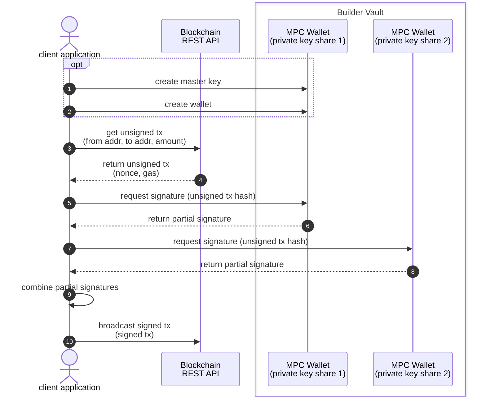

# Ethereum transaction signing with Builder Vault



### Prerequisites
  - Go https://go.dev/doc/install
  - IDE recommended
  - Register for a demo Builder Vault tenant: https://www.blockdaemon.com/get-started/builder-vault-sandbox-registration
  - Download SDK bundle provided in registration email (extract authentication certificates)
  - Place Builder Vault authentication certificates in working directory
  - Register for Blockdaemon API Suite Free key and set as environment variable ACCESS_TOKEN


### Step 1. Create Wallet with Builder Vault and Ethereum chain path
```shell
go run 1-create-wallet/main.go
```
  - note the new Ethereum Wallet address and fund it with Sepolia ETH https://sepolia-faucet.pk910.de
  - note the Builder Vault Master Key ID (to be used for future signing)


### Step 2. Craft an unsigned transaction
  - set the wallet address created in step 1
  - set the destination address to send funds to
```shell
go run 2-craft-transaction/main.go
```
  - check the wallet balance is not 0
  - note the raw unsigned transaction (to be broadcast once signed)
  - note the unsigned transaction hash (to be signed by Builder Vault)
  - (optional) decode the raw unsigned transaction to inspect the Blockdaemon provided attributes (https://rawtxdecode.in)


### Step 3. Sign transaction with BuilderVault wallet library
  - set the Builder Vault Master Key ID to be used for signing (created in step 1)
  - set the unsigned transaction hash to be signed by Builder Vault (created in step 2)
```shell
go run 3-sign-transaction/main.go
```
  - note the transaction signature


### Step 4. Broadcast signed raw transaction
  - set the transaction signature hash (created in step 3)
  - set the raw unsigned transaction (created in step 2)
```shell
go run 4-broadcast-signed-transaction/main.go
```
  - check the transaction hash on a block explorer

